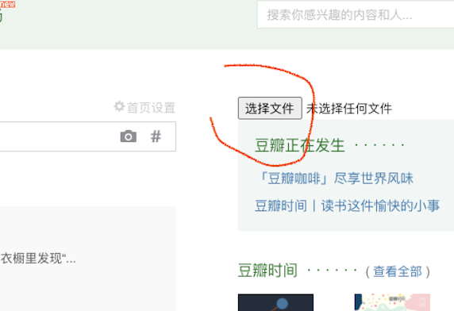

# PinchMoggots
A scripts set to block NMSLeses in https://music.douban.com/subject/35030138/

The scirpt seperated in 2 steps


STEP1:
  - OPEN chrome 
  - OPEN [music.douban.com](music.douban.com)
  - OPEN Console panel cmd+option+J(MAC) Ctrl+Shift+J(WIN)
  - COPY and PASTE the codes below into the pannel
  - PRESS enter
  - SAVE an auto popup list file to local

check [this link](https://github.com/CN-Chrome-DevTools/CN-Chrome-DevTools/blob/master/md/Reference/shortcuts.md) if you don't understand

```
function acquireMaggotListFromCollections(t=0,n=40){return new Promise((o,a)=>{console.log("正在从听过中搜索..."),$.ajax({url:"https://music.douban.com/subject/35030138/collections",data:"start="+t,success:t=>{var a=$("<div/>").html(t).contents(),e=a.find(".sub_ins tr").each((function(t){var o=$(this).find(".pl>span:last-child").attr("class"),a=/\d+/.exec(o)||"",e=parseInt(a[0]);return!!e&&e>=n})).map((function(t){const n=($(this).find("a").attr("href")||"").match(/\/(\d+)\/?$/);return n&&n[1]})).get();const i=a.find(".paginator .next").length>0;o({isContinue:i,data:e})},error:t=>{a(t)}})})}function acquireMaggotListFromReviews(t=0,n=5){return new Promise((o,a)=>{console.log(`正在从乐评${n}星中搜索...`),$.ajax({url:"https://music.douban.com/subject/35030138/reviews?rating="+n,data:"start="+t,success:t=>{var n=$("<div/>").html(t.html).contents().find(".review-item").map((function(t){console.log($(this).find(".main-title-rating").attr("title"));const n=($(this).find(" .main-hd a").attr("href")||"").match(/\/(\d+)\/?$/);return n&&n[1]})).get();const a=t.count>0;o({isContinue:a,data:n})},error:t=>{a(t)}})})}function acquireMaggotListFromComments(t=1,n=40,o="hot"){return new Promise((a,e)=>{console.log(`正在从短评/${o}中搜索...`),$.ajax({url:"https://music.douban.com/subject/35030138/comments/"+o,data:`p=${t}&_=${(new Date).toString()}`,success:t=>{var o=$("<div/>").html(t.paginator).contents(),e=$("<div/>").html(t.content).contents(),i=/后一页/.test(o.find("li:last-child").text()||""),s=e.find("li .comment-info").each((function(t){var o=$(this).find(".rating").attr("class"),a=/\d+/.exec(o)||"",e=parseInt(a[0]);return!!e&&e>=n})).map((function(t){const n=($(this).find("a").attr("href")||"").match(/\/(\d+)\/?$/);return n&&n[1]})).get();a({isContinue:i,data:s})},error:t=>{e(t)}})})}function saveJsonFile(t,n,o){var a=document.createElement("a"),e=new Blob([t],{type:o});a.href=URL.createObjectURL(e),a.download=n,a.click()}async function loopWrapFunc(t,n=0,o=1,...a){for(var e=n,i=!0,s=[];i;){var c=await t(e*o,...a);i=c.isContinue,s=s.concat(c.data),e++}return s}async function joinMaggotList(){var t=await loopWrapFunc(acquireMaggotListFromComments,1),n=await loopWrapFunc(acquireMaggotListFromComments,1,1,40,"new"),o=await loopWrapFunc(acquireMaggotListFromCollections,0,20),a=await loopWrapFunc(acquireMaggotListFromReviews,0,10),e=await loopWrapFunc(acquireMaggotListFromReviews,0,10,4);const i=[].concat(o,t,n,a,e);return console.log(`从短评/热度收集${t.length}只蛆`),console.log(`从短评/最新收集${n.length}只蛆`),console.log(`从听过收集${o.length}只蛆`),console.log(`从乐评5收集${a.length}只蛆`),console.log(`从乐评4收集${e.length}只蛆`),console.log("======================"),console.log(`总计${i.length}只蛆`),i}(async()=>{try{const t=await joinMaggotList();saveJsonFile(JSON.stringify(t),"moggotsList.json","text/plain")}catch(t){console.error(t)}})();

```


STEP2:
  - OPEN chrome 
  - OPEN [www.douban.com](www.douban.com)
  - OPEN Console panel cmd+option+J(MAC) Ctrl+Shift+J(WIN)
  - COPY and PASTE the codes below into the pannel
  - YOU will see a button added in the side board
  - 
  - CLICK the button and select the .json file you saved in STEP1
  - Have a rest to see moggots blocked

```
function openFile(e){var t=document.createElement("input");t.setAttribute("type","file"),t.setAttribute("id","load-moggots"),t.onchange=function(){readText(this,e),$("#load-moggots").remove()},$(".aside").prepend(t)}function readText(e,t){var o;if(!(window.File&&window.FileReader&&window.FileList&&window.Blob))return alert("The File APIs are not fully supported by your browser. Fallback required."),!1;o=new FileReader;var n="";return!(!e.files||!e.files[0])&&(o.onload=function(e){n=e.target.result,t(n)},o.readAsText(e.files[0]),!0)}function getCookie(e){for(var t=e+"=",o=decodeURIComponent(document.cookie).split(";"),n=0;n<o.length;n++){for(var r=o[n];" "==r.charAt(0);)r=r.substring(1);if(0==r.indexOf(t))return r.substring(t.length,r.length)}return""}function ban(e){return new Promise((t,o)=>{var n=getCookie("ck");$.ajax({type:"POST",headers:{Accept:"application/json","Content-Type":"application/x-www-form-urlencoded"},url:"https://www.douban.com/j/contact/addtoblacklist",data:`people=${e}&ck=${n}`,success:function(o){o.result?console.log(`已屏蔽<${e}>蛆`):console.log(`这只<${e}>蛆比较顽固,需要手动处理`),t(o.result)},error:function(e){o(e)}})})}openFile((async function(e){try{const o=JSON.parse(e);var t=0;for(let e=0;e<o.length;e++){await ban(o[e])&&t++}console.log(`本次共拉黑${t}只蛆`)}catch(e){alert("文件读取失败, 操作未能进行,多半是选错文件")}}));
```


LIMITATION: 

- Cuz douban.com doesn't show all rating records;
- So these script cannot grab all moggots' id;
- For now it loops records both in hot/new pannels as more as it could be;
- You better repeat it in a few hours, to block new added;
- For default, all rating higher than 3 (>3) will be blocked;
- But it's configuable if you know how to do;


TODO:
- [X] Will be add more filters for distinguishing
- [ ] Maybe a chrome extension with auto cronjob, but not be sure now, cuz it's only a trending not life

Some views:
- When the website is not on your side, you need to protect yourselves
- I don't think there are 95% moggots now, They are loud only cuz the totalitarianism is on their side
- The worst case scenario is to rebuild an Internet, no big deal
- Keep happy yourself
 
UPDATED:
- Clerifying the data source
- Support finding moggots from reviews\comments\collections and more
- Improve user experience, more console info

--------

<a href="https://www.patreon.com/user/TakehisaYumeji">
  
</a>

